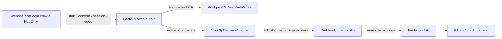

# Plano V1B - Persistencia OTP E Entrega WhatsApp Real

Status: plano historico/superseded para a ponte n8n/Evolution. Backend
PostgreSQL e contratos foram incorporados, mas a direcao operacional atual
substituiu a ativacao n8n/Evolution por Meta WhatsApp Cloud API nativa com
Hermes apenas como adapter temporario. Use este documento somente como contexto
legado, nao como proximo passo ativo.

## Objetivo

Evoluir a V1A de laboratorio para um fluxo integrado privado:

- substituir o store OTP em memoria por PostgreSQL;
- enviar o OTP por webhook interno protegido para o `n8n`;
- entregar a mensagem pelo WhatsApp usando Evolution API;
- validar o fluxo com um numero real sem exposicao publica;
- manter a copy correta: WhatsApp verificado nao significa conta HostGator
  autenticada.

Este plano nao libera producao. Ele cria uma ponte testavel entre backend,
banco, `n8n` e Evolution API.

## Estado De Partida

A V1A ja entrega:

- contratos publicos `/web/auth/*`;
- cookie anonimo `HttpOnly`;
- OTP de seis digitos gerado com `secrets`;
- digest HMAC contextualizado pelo `challenge_id`;
- TTL, cooldown, rate limit e limite de tentativas;
- logs sem telefone bruto e sem OTP;
- `InMemoryWebAuthStore`;
- `InMemoryOtpDeliveryAdapter`.

Pendencias operacionais atuais:

- os rate limits por IP e telefone ainda vivem em memoria;
- o workflow versionado ainda precisa ser ativado e validado no runtime
  privado;
- entrega real, restart completo e idempotencia da Evolution ainda precisam de
  smoke.

## Principios De Arquitetura

- O backend continua dono de OTP, expiracao, tentativas, bloqueio e vinculo da
  sessao.
- O PostgreSQL vira fonte de verdade transacional para identidade de canal.
- O `n8n` apenas transporta a mensagem e devolve status de aceite.
- A Evolution API fica atras do `n8n`, sem contaminar regras do backend.
- Telefone bruto circula somente no transporte servidor-servidor protegido.
- Telefone bruto e OTP nunca entram em logs, relatorios, issues ou PRs.
- A V0 anonima continua disponivel enquanto a V1B e validada.

Analogia simples: o backend e o porteiro que cria e confere a senha temporaria.
O `n8n` e apenas o mensageiro que entrega o envelope pelo WhatsApp. O mensageiro
nao decide se a senha ainda vale.

## Arquitetura Alvo



## Decisoes

### ADR-V1B-01 - Manter monolito modular

Decisao:

- adicionar adapters no backend atual;
- nao criar microsservico de autenticacao nesta etapa.

Motivo:

- o dominio ainda esta amadurecendo;
- um microsservico adicionaria deploy, observabilidade e falhas distribuidas
  antes de existir necessidade comprovada.

### ADR-V1B-02 - PostgreSQL Como Fonte De Verdade

Decisao:

- persistir sessoes web, identidades verificadas e desafios OTP no PostgreSQL
  oficial do ambiente;
- manter o store em memoria apenas para testes unitarios e laboratorio local.

Motivo:

- a identidade verificada precisa sobreviver a restart e funcionar quando
  houver mais de uma instancia da API.

### ADR-V1B-03 - Backend Chama Webhook Interno n8n

Decisao:

- implementar `N8nOtpDeliveryAdapter`;
- nao chamar Evolution API diretamente do core Python.

Motivo:

- preserva separacao de responsabilidades;
- permite trocar fornecedor de WhatsApp sem reescrever autenticacao;
- concentra credenciais Evolution no runtime do workflow.

### ADR-V1B-04 - Confirmacao Continua Sincrona

Decisao:

- manter `POST /web/auth/whatsapp/confirm` sincrono contra PostgreSQL;
- tratar envio externo como side effect com timeout curto e resposta generica.

Motivo:

- validar OTP e uma operacao transacional pequena;
- fila e worker so entram se dados reais mostrarem necessidade.

## Storage PostgreSQL

### Interface Python

Antes do adapter PostgreSQL, extrair um protocolo compartilhado:

```python
class WebAuthStore(Protocol):
    def save_challenge(self, challenge: OtpChallenge) -> None: ...
    def get_challenge(self, challenge_id: str) -> OtpChallenge | None: ...
    def latest_challenge_for_phone(self, phone_hash: str) -> OtpChallenge | None: ...
    def get_identity_for_phone(self, phone_hash: str) -> VerifiedIdentity | None: ...
    def save_identity(self, identity: VerifiedIdentity) -> None: ...
    def bind_session(self, session_hash: str, identity: VerifiedIdentity) -> None: ...
    def get_identity_for_session(self, session_hash: str) -> VerifiedIdentity | None: ...
    def clear_session(self, session_hash: str) -> None: ...
```

`InMemoryWebAuthStore` e `PostgresWebAuthStore` devem implementar o mesmo
contrato.

### Migration Proposta Para Revisao Do Renan

Criar migration nova, sem editar `001_initial_schema.sql`.

Conceitos minimos:

```sql
CREATE TABLE verified_identities (
  id UUID PRIMARY KEY DEFAULT gen_random_uuid(),
  channel TEXT NOT NULL,
  phone_hash TEXT NOT NULL,
  phone_last4 TEXT NOT NULL,
  verified_at TIMESTAMPTZ NOT NULL,
  status TEXT NOT NULL DEFAULT 'verified',
  created_at TIMESTAMPTZ NOT NULL DEFAULT now(),
  updated_at TIMESTAMPTZ NOT NULL DEFAULT now(),
  UNIQUE (channel, phone_hash)
);

CREATE TABLE web_sessions (
  id UUID PRIMARY KEY DEFAULT gen_random_uuid(),
  anonymous_session_hash TEXT NOT NULL UNIQUE,
  verified_identity_id UUID REFERENCES verified_identities(id),
  created_at TIMESTAMPTZ NOT NULL DEFAULT now(),
  last_seen_at TIMESTAMPTZ NOT NULL DEFAULT now()
);

CREATE TABLE otp_challenges (
  id UUID PRIMARY KEY,
  identity_candidate_hash TEXT NOT NULL,
  phone_last4 TEXT NOT NULL,
  code_digest TEXT NOT NULL,
  expires_at TIMESTAMPTZ NOT NULL,
  attempts_remaining INT NOT NULL,
  status TEXT NOT NULL,
  created_at TIMESTAMPTZ NOT NULL,
  consumed_at TIMESTAMPTZ,
  delivery_id UUID,
  delivery_status TEXT,
  CHECK (attempts_remaining >= 0)
);

CREATE INDEX idx_otp_challenges_candidate_created
ON otp_challenges(identity_candidate_hash, created_at DESC);
```

Regras:

- nao persistir `phone_e164`;
- nao persistir OTP puro;
- usar `channel='whatsapp'`;
- definir politica de retencao e limpeza de desafios expirados;
- confirmar OTP com transacao e lock de linha para impedir consumo duplo;
- revisar nomes, indices e constraints com Renan antes de aplicar.

### Concorrencia

O adapter PostgreSQL deve substituir o lock local por garantia transacional:

1. abrir transacao;
2. selecionar desafio com `SELECT ... FOR UPDATE`;
3. verificar status, expiracao e tentativas;
4. consumir ou decrementar tentativas;
5. criar ou localizar identidade verificada;
6. vincular a sessao;
7. confirmar transacao.

Isso evita que duas abas consumam o mesmo OTP ao mesmo tempo.

## Contrato Backend Para n8n

### Endpoint Interno

```http
POST <N8N_OTP_DELIVERY_WEBHOOK_URL>
Content-Type: application/json
X-Request-ID: <request-id>
X-Delivery-ID: <uuid>
X-Webhook-Timestamp: <unix-seconds>
X-Webhook-Signature: sha256=<hmac>
```

Payload:

```json
{
  "delivery_id": "uuid",
  "channel": "whatsapp",
  "phone_e164": "+5511999999999",
  "template": "web_login_otp",
  "variables": {
    "code": "123456",
    "expires_in_minutes": 5
  }
}
```

Resposta de aceite:

```json
{
  "status": "accepted",
  "delivery_id": "uuid"
}
```

### Assinatura

- segredo dedicado: `N8N_OTP_WEBHOOK_SECRET`;
- nao reutilizar `API_SECRET_KEY`, `IDENTITY_HASH_SECRET` ou
  `OTP_DIGEST_SECRET`;
- assinar `timestamp + "." + raw_body`;
- rejeitar timestamps fora de uma janela curta, por exemplo cinco minutos;
- validar com comparacao constante;
- usar HTTPS ou rede privada controlada.

### Idempotencia

- `delivery_id` e gerado pelo backend;
- o workflow deve tratar `delivery_id` repetido como reenvio idempotente;
- timeout ou retry do backend nao pode gerar duas mensagens diferentes;
- logs sanitizados podem registrar apenas `delivery_id`, `request_id`, status
  e codigo de falha.

### Timeout E Falhas

Baseline:

- timeout total do adapter: cinco segundos;
- no maximo uma repeticao automatica para falha transitoria;
- resposta publica permanece `503 otp_delivery_unavailable`;
- falha de entrega marca desafio como `delivery_failed`;
- nao retornar erro bruto da Evolution API ao browser.

Uma fila entra apenas se a operacao real provar que entrega sincrona e
instavel. Nao comprar complexidade antes da medicao.

## Workflow n8n

Responsabilidade do workflow:

1. receber webhook interno;
2. validar assinatura, timestamp e `delivery_id`;
3. rejeitar replay ou payload invalido;
4. montar mensagem curta a partir de template controlado;
5. chamar Evolution API;
6. retornar aceite generico ao backend;
7. registrar somente metadados sanitizados.

O workflow nao deve:

- decidir validade ou consumo do OTP;
- persistir OTP em historico operacional;
- registrar telefone bruto;
- incluir credenciais no JSON exportado;
- acessar tabelas internas do backend;
- confundir WhatsApp verificado com conta HostGator autenticada.

Artefato esperado:

- export JSON sanitizado e versionado do workflow;
- runbook com variaveis obrigatorias sem valores;
- evidencias de smoke sem telefone, OTP ou secrets.

## Variaveis De Ambiente

Backend:

```dotenv
ENABLE_WEB_WHATSAPP_AUTH=true
WEB_AUTH_STORAGE_BACKEND=postgres
DATABASE_URL=<private>
IDENTITY_HASH_SECRET=<private>
OTP_DIGEST_SECRET=<private-different>
N8N_OTP_DELIVERY_WEBHOOK_URL=<private-internal-url>
N8N_OTP_WEBHOOK_SECRET=<private-dedicated-secret>
N8N_OTP_DELIVERY_TIMEOUT_SECONDS=5
```

`n8n`:

```dotenv
N8N_OTP_WEBHOOK_SECRET=<same-private-dedicated-secret>
EVOLUTION_API_BASE_URL=<private>
EVOLUTION_API_KEY=<private>
EVOLUTION_INSTANCE_NAME=<private>
```

Nenhum valor real entra em Git, PR, docs ou relatorio.

## UI E Copy

A UI deve usar:

- `WhatsApp verificado`;
- `Seu WhatsApp final **** foi verificado`;
- `Continuar sem verificar` enquanto a V0 anonima estiver disponivel.

A UI nao deve usar:

- `Conta HostGator autenticada`;
- `Cliente HostGator confirmado`;
- `Acesso liberado a dados da conta`.

Telefone verificado e como confirmar que a pessoa recebeu uma carta naquele
endereco. Isso ainda nao prova que ela e dona da casa.

## Smoke Privado Com WhatsApp Real

Pre-requisitos:

- PR V1A incorporado;
- migration V1B revisada e aplicada no PostgreSQL local privado;
- backend com secrets privados e feature flag ativa;
- webhook interno `n8n` acessivel pelo backend;
- workflow sanitizado ativo;
- Evolution API conectada a um numero de laboratorio;
- numero receptor autorizado para o teste.

Checklist:

1. `GET /health` retorna `200`.
2. `GET /web/auth/session` retorna `anonymous` e cria cookie `HttpOnly`.
3. `POST /web/auth/whatsapp/start` retorna `202` sem telefone ou OTP no corpo.
4. WhatsApp receptor recebe uma unica mensagem com OTP.
5. OTP incorreto retorna `invalid_or_expired_code`.
6. OTP correto retorna `verified` e apenas `phone_last4`.
7. `GET /web/auth/session` retorna `verified`.
8. Reiniciar API preserva sessao verificada.
9. Reutilizar OTP falha.
10. Reenviar dentro do cooldown retorna `429` com `Retry-After`.
11. Derrubar `n8n` faz start retornar `503 otp_delivery_unavailable`.
12. `POST /web/auth/logout` retorna `anonymous`.
13. Logs sanitizados nao contem telefone, OTP, cookie ou secrets.
14. UI mostra `WhatsApp verificado`, nunca conta HostGator autenticada.

Relatorio permitido:

- data;
- ambiente `local-private`;
- status HTTP por etapa;
- `request_id`;
- `delivery_id`;
- latencia;
- status final;
- falhas sanitizadas.

Relatorio proibido:

- telefone;
- OTP;
- cookie;
- payload completo;
- URL interna;
- credenciais;
- logs crus.

## Estrategia De Implementacao

### Etapa 0 - Sequencia

- incorporar PR V1A;
- criar branch V1B a partir da `main` atualizada;
- alinhar migration com Renan e workflow com Juliano.

### Etapa 1 - Backend Persistente

- extrair protocolo `WebAuthStore`;
- implementar `PostgresWebAuthStore`;
- selecionar backend por `WEB_AUTH_STORAGE_BACKEND`;
- manter `memory` apenas em dev/test;
- adicionar testes com substituto deterministico e testes SQL separados.

### Etapa 2 - Adapter n8n

- implementar `N8nOtpDeliveryAdapter`;
- adicionar assinatura, timeout, idempotencia e erros genericos;
- testar HTTP com mock local;
- documentar observabilidade sanitizada.

### Etapa 3 - Workflow

- Juliano valida e opera o workflow sanitizado versionado;
- configurar Evolution API apenas em runtime privado;
- validar aceite idempotente e falha segura.

### Etapa 4 - Smoke E UI

- executar smoke privado com WhatsApp real;
- adicionar telas de telefone e OTP no `ask-host-genius`;
- usar copy explicita de identidade de canal;
- manter rollout atras de feature flag.

## Gates

Backend:

```powershell
python -m compileall app tests scripts
python -m pytest
```

SQL:

```powershell
psql $env:DATABASE_URL -f migrations/<migration-v1b>.sql
```

Integracao:

- smoke privado completo;
- workflow exportado sem credentials;
- logs revisados por nao vazamento;
- V0 anonima sem regressao;
- rollback testado desativando `ENABLE_WEB_WHATSAPP_AUTH`.

## Ownership

| Area | Responsavel primario | Entrega |
| --- | --- | --- |
| contrato HTTP, adapters Python, seguranca e testes | Renan | backend V1B |
| schema, migration, indices e PostgreSQL real | Renan | migration aprovada |
| workflow n8n e Evolution API | Juliano | export JSON sanitizado |
| runtime, HTTPS, secrets e conectividade | Juliano | ambiente privado |
| telas e copy `WhatsApp verificado` | Renan | `ask-host-genius` |

## Criterio De Pronto

A V1B termina quando:

- sessao verificada sobrevive a restart;
- OTP real chega uma unica vez por WhatsApp;
- falhas externas retornam erro seguro;
- logs nao vazam PII nem secrets;
- V0 anonima continua funcional;
- UI distingue WhatsApp verificado de conta HostGator autenticada;
- desligar a feature flag restaura o comportamento anterior sem rollback de
  banco.
