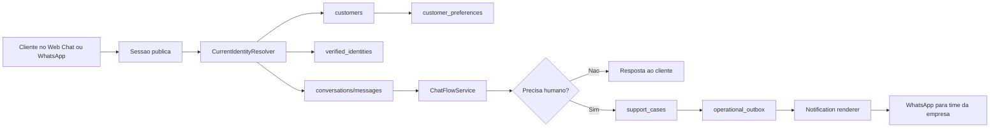

# Plano Tecnico - Identidade Do Cliente, Historico E Handoff WhatsApp

Status: Sprints 1 a 4 iniciais implementadas; **validacao PostgreSQL opt-in OK**
(2026-06-29) — a suite de integracao `tests/integration` (inclui customer
identity/`support_cases` da migration 009, handoff, feedback privacy, conversation
migration upgrade, session domain store, support inbox) passou **31/31** contra
Postgres real, rodada num banco descartavel no servidor da VPS (sequencia de
migration da CI: `apply --target 006` -> backfill de privacidade -> `apply` ->
`verify` = 10 migrations). Migration 009 ja aplicada na box de prod. Em prod, os
`support_cases` ja sao consumidos pelo support inbox (read) e enriquecidos no push
(`ENABLE_SUPPORT_INBOX` ligado; ver `docs/architecture/integration-contracts.md`).
Data de revisao: 2026-06-29.

**Escopo esclarecido (2026-07-01):** o Auth via WhatsApp/OTP neste plano **nao**
existe para unificar identidade entre o WhatsApp nativo (Hermes/Meta) e o web
chat — sao propositalmente canais separados. O objetivo real e mais estreito:
dar ao cliente do **web chat** um fluxo de autenticacao para abrir ticket, e o
motivo de existir Auth **e** exatamente o gate de consentimento LGPD antes de a
equipe poder entrar em contato direto com o cliente. Ou seja: Auth nao e sobre
"saber quem e o cliente" de forma geral, e sim sobre **autorizacao explicita
para contato direto no momento do handoff**. O WhatsApp nativo ja tem
continuidade de historico "boa o suficiente" via hash deterministico do
telefone (`_safe_hermes_session_id`), sem depender de `customer_id`/Auth — isso
e aceito como permanente, nao e gap a fechar.

**Cripto do web chat validada (2026-07-01):** telefone via HMAC-SHA256 chaveado
(`IDENTITY_HASH_SECRET`), OTP de 6 digitos com `secrets.randbelow` (CSPRNG),
digest do codigo nunca em texto puro e escopado por `challenge_id`
(`OTP_DIGEST_SECRET`), `attempts_remaining` decrementa e trava o desafio,
expiracao checada, rate limit por IP e por telefone na geracao. Considerado
aceitavel. Nitpick nao bloqueante: `consume_challenge` compara o digest com
`!=` em vez de `hmac.compare_digest` (constant-time) — o `attempts_remaining`
ja fecha a janela de forca bruta, entao nao e risco pratico, so troca
recomendada por defesa em profundidade.

**Gap real encontrado (2026-07-01):** a intencao acima ("handoff so autoriza
contato direto apos LGPD/Auth") **nao esta implementada**. Hoje
`_upsert_support_case` (`app/db/operational.py`) cria o `support_case` e
enfileira a notificacao ao time incondicionalmente quando `escalated=True` —
`customer_id` e aceito `None` sem nenhum gate. Decisao pendente com o Renan
sobre o desenho exato do gate (ver secao de proximos passos abaixo).

## Diagnostico

O projeto ja tem pecas importantes para esta frente:

- Auth via WhatsApp no web chat, protegido por feature flag.
- Sessao publica anonima via cookie `web:<uuid>`.
- Historico sanitizado de conversas por `domain`, `channel` e hash de sessao.
- Handoff automatico quando a resposta precisa de humano.
- Outbox operacional para entregar eventos externos de forma idempotente.
- Base Meta WhatsApp nativa em andamento, com Hermes apenas como adapter
  temporario.

O que ainda nao existe como contrato fechado:

- Um `customer_id` interno e estavel para juntar identidade, historico,
  preferencias e suporte humano.
- Um ticket/caso de suporte duravel. Hoje o handoff grava evento
  `handoff.requested` na outbox, mas isso nao e a mesma coisa que uma entidade
  de suporte com status, dono, contexto e historico.
- Um fluxo oficial para avisar o time da empresa via WhatsApp com contexto
  sanitizado do cliente.
- Um contrato para configuracoes do cliente no front end ligadas a identidade
  verificada.

Analogia simples: hoje temos varios papeis na mesa. Um papel prova o telefone,
outro guarda a conversa, outro toca a campainha do suporte. O que falta e uma
pasta com o nome interno do cliente. Essa pasta e o `customer_id`.

## Decisao Recomendada

Criar primeiro a base de dados e o contrato de identidade do cliente. Depois,
adaptar o Auth existente para preencher esse contrato. So depois disso conectar
historico, configuracoes de front end, ticket de suporte e notificacao por
WhatsApp.

Ordem recomendada:

1. Definir contrato de identidade e riscos de merge.
2. Criar schema expand-only para cliente, preferencias e caso de suporte.
3. Ligar o Auth WhatsApp existente ao `customer_id`.
4. Fazer o historico resolver por cliente quando houver identidade verificada.
5. Transformar handoff em `support_case` duravel.
6. Notificar time pelo WhatsApp usando evento de mensagem, nao regra de negocio
   dentro do provedor externo.
7. Expor dados e preferencias no front end com autoridade no backend.

## Prompt Spec Da Entrega

Objetivo:

- Integrar Auth via WhatsApp, historico do cliente, preferencias de front end e
  handoff humano com contexto para o time da empresa.

Usuarios/downstream:

- Cliente final no web chat ou WhatsApp.
- Time da empresa que recebe escalacoes humanas.
- Renan para arquitetura, contratos, seguranca, testes e aplicacao.
- Juliano para runtime, VPS, secrets, restore, Meta/Hermes e conectividade
  externa.

Inputs:

- `docs/architecture/integration-contracts.md`
- `docs/architecture/architecture.md`
- `docs/architecture/observability.md`
- `docs/MVP/technical-implementation-plan.md`
- `app/api/routes/web_auth.py`
- `app/web_auth/service.py`
- `app/web_auth/storage.py`
- `app/api/routes/web_chat.py`
- `app/conversations/service.py`
- `app/conversations/repository.py`
- `app/db/operational.py`
- `scripts/dispatch_outbox.py`
- `app/db/schema_contract.py`
- migracoes em `migrations/`

Nao objetivos:

- Nao reimplementar o Auth do zero.
- Nao salvar telefone bruto, OTP, token, payload completo ou session id bruto.
- Nao transformar Meta, Hermes ou Evolution em regra de negocio.
- Nao usar outbox como banco de tickets.
- Nao tentar recuperar historico antigo que nao possui vinculo de identidade.
- Nao ativar fluxo real de Meta antes de smoke privado e restore isolado.

Output esperado:

- Contrato de dados versionado.
- Resolver central de identidade atual.
- Historico por cliente quando autenticado.
- Caso de suporte duravel no banco.
- Notificacao WhatsApp sanitizada e idempotente para o time.
- Testes cobrindo privacidade, idempotencia, migracao e fluxo feliz.

## Estado Atual Que Podemos Reaproveitar

Auth:

- `/web/auth/whatsapp/start`
- `/web/auth/whatsapp/confirm`
- `/web/auth/session`
- `verified_identities`
- `web_sessions`
- `otp_challenges`

Historico:

- `ConversationHistoryService.load_recent`
- `OperationalRepository.record_chat`
- `conversations`
- `messages`
- hashing com `PERSISTENCE_HASH_SECRET`

Handoff:

- deteccao de escalacao no fluxo atual.
- `operational_outbox` com `event_type='handoff.requested'`.
- payload sanitizado com `request_id`, `domain`, `handoff_reasons`,
  `references`, `error_code` e `summary`.

Entrega externa:

- `scripts/dispatch_outbox.py`
- transporte `internal_webhook`
- transporte `meta_whatsapp` para `whatsapp_message`
- separacao atual entre evento interno e provider externo.

Observabilidade e seguranca:

- contrato de logs sem prompt bruto, PII bruta, OTP, token ou payload completo.
- readiness de banco, migracoes, retrieval e outbox.
- migrations forward-only.

## Ponto Critico - Dois Hashes Da Mesma Sessao

Hoje o Auth e o historico nao usam o mesmo hash para a mesma sessao:

- Auth usa `IDENTITY_HASH_SECRET`.
- Historico usa `PERSISTENCE_HASH_SECRET`.

Isso e bom para privacidade, mas impede join direto no banco entre
`web_sessions.anonymous_session_hash` e `conversations.session_hash`.

Regra de implementacao:

- Nunca tentar juntar essas tabelas comparando hashes.
- Criar um `CurrentIdentityResolver` no backend.
- O resolver recebe a sessao bruta somente dentro da request.
- Ele calcula os dois hashes em memoria.
- Ele resolve a identidade no Auth.
- Ele resolve a conversa pelo hash de persistencia.
- Ele retorna um contexto interno com `customer_id`, `verified_identity_id`,
  `session_hash` e flags de autenticacao.

Analogia simples: sao duas chaves diferentes para duas portas diferentes da
mesma casa. Nao se compara uma chave com a outra. O porteiro autorizado recebe
as duas chaves e sabe abrir cada porta.

## Arquitetura Alvo



Contrato central:

- `customers` e a entidade interna.
- `verified_identities` prova canais verificados, como WhatsApp.
- `web_sessions` liga sessao anonima a identidade verificada.
- `conversations` guarda historico sanitizado.
- `support_cases` guarda ticket/caso humano.
- `operational_outbox` entrega eventos, mas nao vira fonte de verdade do caso.

## Modelo De Dados Proposto

### `customers`

Nova tabela. Representa o cliente interno, sem telefone bruto.

Campos sugeridos:

- `id uuid primary key`
- `status text not null default 'active'`
- `display_label text null`
- `default_channel text null`
- `last_seen_at timestamptz null`
- `created_at timestamptz not null`
- `updated_at timestamptz not null`

Observacoes:

- `display_label` deve ser opcional e sanitizado.
- Nao salvar telefone bruto.
- Evitar campos de CRM grandes nesta fase.

### `verified_identities`

Tabela existente. Expandir sem quebrar contrato atual.

Mudanca sugerida:

- adicionar `customer_id uuid null references customers(id)`.

Regras:

- `channel + phone_hash` continua unico.
- ao confirmar OTP, criar ou reutilizar `customers`.
- se uma identidade antiga nao tiver `customer_id`, preencher na primeira
  confirmacao ou job de backfill seguro.

### `web_sessions`

Tabela existente. Pode continuar ligando sessao a `verified_identity_id`.

Regra:

- nao duplicar `customer_id` aqui no MVP, a menos que uma consulta medida prove
  necessidade. A relacao pode ser derivada por `verified_identity_id`.

### `conversations`

Tabela existente. Expandir para permitir historico por cliente.

Mudanca sugerida:

- adicionar `customer_id uuid null references customers(id)`.

Regras:

- conversas anonimas continuam funcionando por `session_hash`.
- conversas autenticadas passam a gravar `customer_id`.
- ao autenticar uma sessao atual, vincular a conversa ativa dessa sessao ao
  `customer_id` quando isso for seguro.
- nao tentar vincular conversas antigas de outras sessoes sem prova.

### `customer_preferences`

Nova tabela para configuracoes do front end.

Campos sugeridos:

- `id uuid primary key`
- `customer_id uuid not null references customers(id)`
- `domain_id uuid null references domains(id)`
- `preferences_json jsonb not null`
- `version integer not null default 1`
- `created_at timestamptz not null`
- `updated_at timestamptz not null`

Regras:

- salvar apenas preferencias de produto, nao segredos.
- validar chaves permitidas no backend.
- nao confiar em payload de front end como autoridade de identidade.

### `support_cases`

Nova tabela. Fonte de verdade do ticket humano.

Campos sugeridos:

- `id uuid primary key`
- `domain_id uuid not null references domains(id)`
- `customer_id uuid null references customers(id)`
- `conversation_id uuid null references conversations(id)`
- `opening_message_id uuid null references messages(id)`
- `request_id text not null`
- `channel text not null`
- `status text not null default 'open'`
- `priority text not null default 'normal'`
- `reason_codes jsonb not null`
- `context_snapshot_sanitized jsonb not null`
- `idempotency_key text not null unique`
- `assigned_team text null`
- `opened_at timestamptz not null`
- `updated_at timestamptz not null`
- `closed_at timestamptz null`

Regras:

- criar dentro da mesma transacao que persiste a conversa escalada.
- `idempotency_key` deve impedir ticket duplicado no retry.
- snapshot deve conter contexto suficiente para atendimento, mas sem PII bruta.
- status de conversa pode continuar `handoff_pending`, mas o ticket vive em
  `support_cases`.

### `support_case_events`

Opcional no MVP, recomendado se houver status humano real.

Uso:

- registrar abertura, notificacao enviada, assumido por humano, comentario
  interno, fechamento e erro de entrega.

Se o time ainda nao tiver console humano, pode ficar para depois. O minimo
necessario e `support_cases`.

## Fluxo Alvo - Auth E Historico

1. Cliente abre o chat.
2. Backend cria ou reutiliza cookie anonimo `web:<uuid>`.
3. Cliente informa WhatsApp para verificar identidade.
4. OTP e enviado por adapter autorizado.
5. Cliente confirma OTP.
6. Auth cria ou reutiliza `verified_identity`.
7. Auth cria ou reutiliza `customer`.
8. `web_sessions` liga a sessao anonima a identidade verificada.
9. `CurrentIdentityResolver` passa a devolver `customer_id` para o chat.
10. Novas mensagens gravam `customer_id` em `conversations`.
11. Historico passa a priorizar `customer_id` quando autenticado.

Regra de privacidade:

- O cliente so deve ver historico que pertence ao `customer_id` autenticado ou
  a sessao anonima atual.
- Historico antigo anonimo de outra sessao nao deve aparecer so porque o
  telefone parece o mesmo; precisa vinculo comprovado.

## Fluxo Alvo - Handoff Para Humano Pelo WhatsApp

1. Cliente pergunta algo.
2. `ChatFlowService` tenta responder com RAG e politica de confianca.
3. Se precisar humano, o fluxo marca `escalated=true`.
4. `OperationalRepository.record_chat` persiste conversa e mensagens.
5. Na mesma transacao, cria ou reutiliza `support_case`.
6. Cria evento na `operational_outbox` apontando para `support_case_id`.
7. Um renderer monta mensagem curta para o time:
   - id do caso
   - dominio
   - motivo da escalacao
   - resumo sanitizado
   - ultimas mensagens sanitizadas
   - referencias relevantes
   - label do cliente, como final do telefone, se permitido
   - link ou identificador interno para retomar atendimento
8. Dispatcher envia WhatsApp para o time pela rota de mensagem autorizada.
9. Entrega e erro ficam auditaveis sem expor payload bruto em log.

Decisao importante:

- Nao entregar `handoff.requested` diretamente pelo transporte
  `meta_whatsapp`. O dispatcher atual permite `meta_whatsapp` apenas para
  `whatsapp_message`. Portanto, o fluxo correto e:
  `handoff.requested` cria caso -> renderer cria `whatsapp.message.requested`
  para os destinatarios internos.

## WhatsApp Para O Time Da Empresa

Para MVP, preferir uma lista de destinatarios internos verificados, nao grupo.

Motivos:

- A Cloud API normalmente e pensada para conversas com numeros individuais.
- Grupo de WhatsApp pode depender de caminho nao oficial, provider externo ou
  restricoes de produto.
- Uma lista interna idempotente e mais facil de auditar e reprocessar.

Contrato sugerido:

- `SUPPORT_TEAM_WHATSAPP_RECIPIENTS` ou tabela futura de roteamento.
- um evento `whatsapp.message.requested` por destinatario.
- `idempotency_key` incluindo `support_case_id + recipient`.
- mensagem com template aprovado quando necessario.

Texto do alerta deve ser curto e operacional:

```text
Novo atendimento humano
Caso: CASE-123
Dominio: suporte-vps-whatsapp
Motivo: baixa confianca / precisa acao humana
Cliente: WhatsApp final 1234
Resumo: cliente nao conseguiu acessar painel apos migracao.
Referencias: KB-12, KB-41
Abrir: <identificador interno ou URL segura>
```

## Configuracoes Do Front End

Auth resolve a base para configuracoes do cliente, mas nao resolve sozinho.

Necessario:

- endpoint para ler preferencias do cliente autenticado.
- endpoint para atualizar preferencias permitidas.
- validacao de schema no backend.
- fallback anonimo quando nao houver Auth.
- testes garantindo que um cliente nao le preferencias de outro.

Exemplos de preferencias seguras:

- canal preferido.
- idioma.
- estado de UI.
- opt-in de notificacao, se aplicavel.

Evitar nesta fase:

- credenciais.
- chaves externas.
- configuracoes que autorizem acoes sensiveis.
- qualquer coisa derivada apenas do localStorage.

## Fases Da Sprint

### Sprint 0 - Contrato E Decisoes De Risco

Objetivo:

- Fechar contrato antes de mexer em codigo sensivel.

Entregas:

- este plano revisado.
- nomes finais de tabelas e campos.
- politica de merge de identidade.
- politica de destinatarios internos do WhatsApp.
- decisao sobre `support_case_events` no MVP.

Criterio de pronto:

- ninguem precisa adivinhar se handoff e ticket, evento ou mensagem externa.

### Sprint 1 - Base De Dados Expand-Only

Status:

- implementado em `migrations/009_customer_identity_support_cases.sql`
  e `app/db/schema_contract.py`.
- validado em PostgreSQL descartavel (suite opt-in 31/31, 2026-06-29).

Objetivo:

- Criar base sem mudar comportamento visivel.

Arquivos provaveis:

- `migrations/009_customer_identity_support_cases.sql`
- `app/db/schema_contract.py`
- `tests/integration/test_phase0_postgres.py`
- `tests/integration/test_conversation_migration_upgrade.py`

Entregas:

- tabelas `customers`, `customer_preferences`, `support_cases`.
- coluna `verified_identities.customer_id`.
- coluna `conversations.customer_id`.
- indices e constraints de idempotencia.
- contrato de schema atualizado.

Criterio de pronto:

- migracao aplica em banco limpo e banco migrado.
- contrato de schema falha se tabela/constraint critica sumir.
- nenhum fluxo existente muda com feature flags desligadas.

### Sprint 2 - Resolver De Identidade Atual

Status:

- inicio implementado com `app/identity/current.py`.
- Auth WhatsApp ja cria ou reutiliza `customer_id` internamente.
- resolver plugado no web chat e historico por cliente.

Objetivo:

- Centralizar a traducao entre sessao, Auth e cliente.

Arquivos provaveis:

- `app/web_auth/service.py`
- `app/web_auth/storage.py`
- `app/api/routes/web_auth.py`
- novo modulo `app/identity/current.py`
- testes em `tests/test_web_auth.py`

Entregas:

- `CurrentIdentityResolver`.
- criacao/reuso de `customers` ao confirmar OTP.
- retorno de sessao autenticada com `customer_id` interno quando aplicavel.
- logs com hash/ids seguros, sem telefone bruto.

Criterio de pronto:

- usuario autenticado resolve sempre o mesmo `customer_id`.
- sessao anonima continua anonima.
- Auth em storage memory continua lab-only.

### Sprint 3 - Historico Por Cliente

Status:

- implementado em `ConversationHistoryService`, `ConversationRepository`,
  `ChatFlowService` e `/web/chat`.
- historico autenticado prioriza `customer_id`.
- historico anonimo nao le conversa ligada a cliente autenticado.
- troca de identidade na mesma sessao arquiva a conversa para a sessao, mas
  preserva o historico do cliente.
- validado em PostgreSQL descartavel (suite opt-in 31/31, 2026-06-29).

Objetivo:

- Usar `customer_id` para carregar historico autenticado sem quebrar historico
  anonimo.

Arquivos provaveis:

- `app/conversations/service.py`
- `app/conversations/repository.py`
- `app/db/operational.py`
- `app/api/routes/web_chat.py`
- `tests/test_conversation_history.py`

Entregas:

- grava `customer_id` em conversas novas autenticadas.
- carrega historico por cliente quando Auth estiver confirmado.
- preserva fallback por `session_hash` para anonimos.
- vincula conversa atual ao `customer_id` quando a sessao acabou de autenticar.

Criterio de pronto:

- cliente autenticado ve seu historico.
- cliente anonimo nao herda historico de telefone.
- cliente A nao acessa historico do cliente B.

### Sprint 4 - Ticket Humano Duravel

Status:

- implementado em `OperationalRepository.record_chat`.
- `support_cases` e criado ou reutilizado antes da outbox.
- `handoff.requested` passa a carregar `support_case_id`.
- retry do mesmo turno usa idempotencia do caso e da outbox.
- validado em PostgreSQL descartavel (suite opt-in 31/31, 2026-06-29).

Objetivo:

- Transformar escalacao em caso de suporte persistente.

Arquivos provaveis:

- `app/db/operational.py`
- novo repositorio/servico `app/support_cases/`
- `tests/test_handoff.py` ou testes de operational repository
- `docs/architecture/integration-contracts.md`

Entregas:

- cria `support_case` no handoff.
- usa `idempotency_key` para evitar duplicidade.
- inclui contexto sanitizado.
- outbox passa a referenciar `support_case_id`.

Criterio de pronto:

- retry da mesma escalacao nao cria dois tickets.
- caso existe mesmo se notificacao externa falhar.
- payload nao contem telefone bruto, prompt bruto ou session id bruto.

### Sprint 4b - Gate De Consentimento LGPD No Handoff (decidido 2026-07-01, nao implementado)

Status: ⬜ desenho fechado com o Renan, sem codigo ainda. Fecha o gap descrito
no topo do documento ("Gap real encontrado").

Objetivo:

- Handoff no **web chat** so autoriza contato direto da equipe apos o cliente
  autenticar via OTP, disparado no momento exato da intencao de escalar (nao
  upfront). Fora de escopo por agora: WhatsApp nativo (Hermes/Meta), onde o
  numero ja e conhecido pelo proprio canal — OTP ali seria redundante.

Fluxo alvo:

1. Cliente conversa normalmente no web chat (anonimo, sem Auth).
2. Cliente sinaliza que quer falar com atendente (intencao de handoff, deteccao
   atual do `ChatFlowService`).
3. Bot pergunta explicitamente se o cliente confirma que quer atendimento
   humano.
4. Se sim, dispara OTP (reaproveita `WebWhatsAppAuthService.start`).
5. Cliente digita o codigo (`confirm`).
6. **So apos OTP confirmado**: `support_case` e criado (ou confirmado) e a
   notificacao ao time e enfileirada. Mensagem automatica de confirmacao volta
   ao cliente com numero do ticket, tema, data/hora e o contexto sanitizado que
   sera passado ao atendente (transparencia = parte do consentimento
   informado).

Decisoes de design fechadas (2026-07-01):

- **Abandono do OTP**: se o cliente confirmar intencao mas nao completar o
  codigo, o sistema **lembra em 15 minutos** com uma nova mensagem automatica
  pedindo para completar o codigo. A conversa/intencao de escalacao continua
  sendo persistida normalmente (sinal preservado para metricas internas via
  `escalated=true` no turno); o `support_case` formal e a notificacao ao time
  so nascem apos o OTP confirmado. Implementacao provavel: job/scan (mesmo
  padrao do systemd timer da sumarizacao) que varre desafios `pending` sem
  lembrete enviado, mais velhos que 15 min, e dispara reenvio pelo mesmo
  transporte da entrega original (`WEB_AUTH_OTP_DELIVERY_TRANSPORT`), 
  respeitando `otp_resend_cooldown_seconds`/`otp_code_ttl_seconds` (se o
  desafio original ja expirou, o lembrete deve gerar um novo desafio, nao
  tentar reusar um codigo morto).
- **Origem do nome — investigado e descartado o "get automatico"**: o
  WhatsApp so entra no fluxo de OTP como canal de **envio** (`send_text`); a
  confirmacao do codigo acontece pelo cliente digitando na tela do web chat
  (`POST /web/auth/whatsapp/confirm`), entao o sistema nunca recebe uma
  mensagem *de volta* pelo WhatsApp nesse fluxo — e e so numa mensagem
  recebida que a Cloud API entrega `contacts[].profile.name` (que hoje nem e
  parseado em `app/integrations/meta_whatsapp/schemas.py`, mesmo no canal
  nativo). Pegar o nome automatico exigiria mudar a confirmacao para acontecer
  via resposta no WhatsApp em vez de digitar no widget — mudanca de
  arquitetura maior, e o nome capturado seria um apelido nao verificado, nao
  identidade real. **Decisao: pedir o nome como campo simples no fluxo do
  handoff** (ex.: "qual seu nome?"), dado explicitamente pelo cliente,
  gravado em `customers.display_label` (ja opcional no schema).
- **WhatsApp nativo confirmado fora do escopo do gate**: no web chat o
  visitante e anonimo ate provar o telefone via OTP; no WhatsApp nativo
  (Hermes/Meta) o numero ja e conhecido desde a primeira mensagem — a propria
  plataforma garante que quem manda e dono daquele WhatsApp, e a equipe
  responde **na mesma conversa que o cliente iniciou** (nao e contato novo
  "do nada"). Por isso o gate de consentimento fica restrito ao web chat;
  handoff no WhatsApp nativo continua funcionando como hoje, sem esse passo
  extra.
- Onde este passo entra no codigo: provavelmente um novo estado no
  `ChatFlowService` (equivalente ao `ESCAPE_STATE` do Hermes, mas para o web
  chat) que segura o turno em "aguardando nome + OTP" antes de chamar
  `_upsert_support_case`, em vez de criar o caso incondicionalmente como hoje.

Criterio de pronto:

- sem OTP confirmado, nenhum `support_case`/notificacao nasce para o web chat.
- conversa/intencao de escalacao nao se perde mesmo se o cliente abandonar o OTP.
- cliente recebe lembrete automatico em 15 min se nao completar o codigo.
- mensagem de confirmacao ao cliente reflete exatamente o que foi enviado ao
  time (sem PII alem do que ja e sanitizado), incluindo o nome quando
  informado.
- WhatsApp nativo (Hermes/Meta) continua sem esse gate — handoff la funciona
  como hoje.

### Sprint 5 - Notificacao WhatsApp Para O Time

Status:

- implementado. Renderer puro `app/notifications/support_team.py`; o write path
  (`app/db/operational.py`) enfileira um `whatsapp.message.requested` por
  destinatario na mesma transacao do `support_case`, atras das flags
  `ENABLE_SUPPORT_TEAM_WHATSAPP_NOTIFY` (default off) e
  `SUPPORT_TEAM_WHATSAPP_RECIPIENTS`. Entrega reaproveita a rota
  `whatsapp_message` ja existente (sem mudar o dispatcher).
- testes em `tests/test_support_team_notifications.py` (renderer + write path).
- runbook em `docs/runbooks/support-team-whatsapp-notify-smoke.md`.
- pendente: smoke privado de envio real (depende dos secrets/runtime Meta da
  outra frente).

Objetivo:

- Avisar a equipe com contexto suficiente e sem vazar dados indevidos.

Entregas:

- renderer `support_case -> whatsapp.message.requested`.
- um evento por destinatario interno.
- idempotencia por caso e destinatario (`support_notify:<turn_id>:<hash>`).
- feature flag/transport disabled por padrao.
- runbook de smoke privado.

Criterio de pronto:

- com transporte disabled, eventos ficam auditaveis sem enviar.
- com transporte Meta em ambiente privado, mensagem chega a destinatario
  autorizado.
- falha de envio nao perde o caso.

### Sprint 6 - Preferencias E Front End

Objetivo:

- Ligar configuracoes do front end ao cliente autenticado.

Arquivos provaveis:

- endpoints web novos ou extensao de `/web/auth/session`
- componentes do web chat
- `tests/test_web_auth.py`
- testes de contrato da API web

Entregas:

- ler preferencias autenticadas.
- atualizar preferencias permitidas.
- fallback anonimo.
- UI refletindo estado autenticado.

Criterio de pronto:

- troca de dispositivo com mesmo WhatsApp recupera preferencias autorizadas.
- logout remove acesso local ao contexto autenticado.
- localStorage nao vira fonte de verdade.

## Riscos Que Podem Quebrar O Plano

### 1. Misturar Auth Com Historico Sem Resolver Central

Risco:

- duplicar logica em rotas e servicos.
- vazar historico entre clientes.
- depender de hash errado.

Mitigacao:

- criar `CurrentIdentityResolver` antes de plugar historico.

### 2. Tratar Outbox Como Ticket

Risco:

- perda de estado humano.
- impossibilidade de saber se alguem assumiu ou fechou o caso.
- duplicidade em retry.

Mitigacao:

- `support_cases` e fonte de verdade; outbox so entrega.

### 3. Tentar Backfill Agressivo De Conversas Antigas

Risco:

- associar conversa anonima ao cliente errado.
- quebrar promessa de privacidade.

Mitigacao:

- vincular apenas sessao atual autenticada ou dados com prova forte.

### 4. Colocar Telefone Bruto No Banco Ou Logs

Risco:

- quebra do contrato de privacidade.
- aumento de superficie de vazamento.

Mitigacao:

- manter `phone_hash`, `phone_last4` e snapshots sanitizados.

### 5. Mandar WhatsApp Para Grupo Como Requisito Do MVP

Risco:

- travar integracao em limitacao externa.
- empurrar o projeto para provider nao oficial.

Mitigacao:

- MVP envia para lista de numeros internos verificados.
- grupo fica como decisao posterior, se houver caminho oficial/seguro.

### 6. Auth Funcionar Sem Persistencia De Conversa

Risco:

- `WEB_AUTH_STORAGE_BACKEND=postgres` ativo com `PERSISTENCE_BACKEND` desligado
  pode autenticar, mas nao criar historico/ticket.

Mitigacao:

- readiness deve alertar combinacoes invalidas para Auth + historico + handoff.

### 7. Fazer Tudo Em Uma Sprint

Risco:

- migracao, Auth, historico, handoff, WhatsApp e UI falham juntos.

Mitigacao:

- sprints pequenas com flags e validacao independente.

## Validacao Tecnica

Para cada sprint com codigo:

- `python -m compileall app scripts tests`
- `python -m pytest tests/test_web_auth.py`
- `python -m pytest tests/test_conversation_history.py`
- `python -m pytest tests/test_phase0_operational_safety.py`
- `python -m pytest tests/integration/test_conversation_migration_upgrade.py`
- `python -m pytest tests/integration/test_phase0_postgres.py`
- checks de readiness quando banco real estiver disponivel.

Para fluxos com retrieval local:

- preferir `RETRIEVAL_BACKEND=lexical` quando a infra pgvector local nao estiver
  ativa.

Para privacidade:

- revisar payloads de outbox.
- revisar logs novos.
- revisar fixtures e diffs para evitar padroes parecidos com segredo.

Para Meta/WhatsApp real:

- manter transporte disabled ate smoke privado.
- validar destinatario interno autorizado.
- validar que a mensagem recebida nao expoe PII bruta.
- validar retry/idempotencia.

## Criterios De Pronto Da Frente

A frente esta pronta quando:

- Auth WhatsApp cria ou resolve `customer_id`.
- Historico autenticado carrega por cliente.
- Historico anonimo continua isolado.
- Handoff cria `support_case` duravel.
- Time recebe notificacao WhatsApp com contexto sanitizado.
- Retry nao duplica caso nem mensagem por destinatario.
- Preferencias do front end sao lidas/escritas pelo backend.
- Logs e banco continuam sem telefone bruto, OTP, prompt bruto, tokens ou
  session id bruto.
- Readiness detecta configuracao invalida para Auth + historico + handoff.
- Restore isolado e smoke privado Meta continuam como gates operacionais antes
  de producao real.

## Sequencia Imediata Recomendada

1. Revisar este plano e fechar nomes finais.
2. Criar migracao expand-only de `customers`, `support_cases` e colunas de FK.
3. Atualizar contrato de schema.
4. Implementar `CurrentIdentityResolver`.
5. Plugar Auth em `customer_id`.
6. Plugar historico em `customer_id`.
7. Plugar handoff em `support_cases`.
8. Implementar renderer de notificacao para time.
9. Expor preferencias do front end.

Se for necessario cortar escopo, o corte seguro e:

- manter `customer_preferences` para depois.
- manter `support_case_events` para depois.
- manter grupo WhatsApp para depois.

O que nao deve ser cortado:

- `customer_id`.
- resolver central de identidade.
- `support_cases`.
- idempotencia.
- privacidade de logs e payloads.
